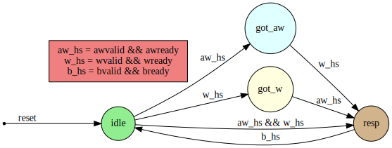

# axi4-lite-slave-verilog
AXI4-Lite slave interface in Verilog with FSM-based read/write channels

## Brief Overview
An AXI4-Lite slave/subordinate is a protocol designed by ARM under the AMBA (Advanced Microcontroller Bus Architecture) family. It has a few features such as single-outstanding write transaction and independent read and write channels. 
It is widely used in the industry and is a standard protocol for intra-system communication.
I have used a register array of 128 registers each of 32 bits i.e 128 x 32-bit register mapping.
A Moore-style FSM was used to map the working of write channel and flag-based design was chosen for read channel.
The terms master/slave are used in accordance with the legacy AXI signal naming. The newer versions use manager/subordinate.

## Note on design methodology
The write channel uses a Moore-style FSM to cleanly handle the independent arrival of write address (AW) and write data (W) which is a key AXI4-Lite requirement. 
The read channel uses a simpler flag-based approach since its sequencing is strictly ordered and doesn't need state branching.

## Write Channel 
### FSM
Four states: IDLE → GOT_AW → GOT_W → RESP
The FSM handles all three AW/W arrival orderings:

AW first → IDLE → GOT_AW, waits for W
W first → IDLE → GOT_W, waits for AW
Both simultaneously → IDLE → RESP directly

Actual register write happens only in RESP, after both AW and W handshakes are confirmed. Write data is held in latched_data_w until then.
bresp returns OKAY (2'b00) on success and SLVERR (2'b10) on invalid address. Per spec, the transaction completes regardless.

The Moore-style FSM for the write channel and the respective transistions are shown below :

  

## Read Channel
Flow control is handled with a single assignment:
        assign arready = ~rvalid;
This prevents a new read address from being accepted while a read response is pending, enforcing the single-outstanding-transaction requirement without a full FSM.

rresp returns OKAY (2'b00) on success, SLVERR (2'b10) on invalid address. Transaction completes regardless, per spec.

## Register Map

The design implements 128 memory-mapped registers.

- Each register is 32 bits wide
- Address space size: 128 × 4 bytes = 512 bytes
- Valid address range: 0x000 to 0x1FC
- Word-aligned accesses assumed

## Design assumptions and choices

- Only single-beat transactions supported (AXI4-Lite limitation)
- No burst support
- Word-aligned accesses assumed
- No byte strobe handling (if true)
- Fully synchronous to single clock
- Active-high synchronous reset

## Elaboration on the flow control

AXI4-Lite supports only a single outstanding transaction per channel since it does not use transaction IDs.
To enforce this for the read channel, arready is driven using simple combinational logic in my design.
The code snippet is as follows :

  assign arready = ~rvalid
  
This makes sure that arready becomes low whenever rvalid becomes high and vice-versa. This ensures that only one outstanding read transaction requirement is met.

## VERIFICATION
The design was verified using a behavioral testbench that covers:

- Read after write
- Invalid address access
- Simultaneous AW and W arrival
- Back-to-back transactions

Tools used are - iverilog (for simulation) and GTKWave (for waveform analysis)

The iverilog commands are as follows :
  - iverilog -o s_axi.vvp S_AXI_TOP.v S_AXI_tb.v
  - vvp s_axi.vvp
  - gtkwave s_axi.vcd
   
The waveform generated after the simulation is as shown below : 

  

## Future Improvements
- Add byte strobes (wstrb).
- Add formal verification.
- Add parameterization for register depth. 
